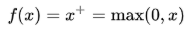

# Clustering e Redes Neurais

### Desenvolvedores: 

    Gabriel Koyama: 
    Lucas Monteiro: 
    
# Introdução

   Certamente cada vez mais a área de ciência de dados, cresce conforme o
tempo, se tornando uma importante área para a computação contribuindo também
com diversas outras áreas correlacionadas. Este trabalho tem como objetivo mostrar
um pouco dessa área fascinante apresentando 2 tópicos de pesquisa e
desenvolvimento muito importantes para os dias de hoje, que são Clustering e
Redes neurais.

   Estes dois tópicos estão presentes no mundo da computação a mais tempo
do que parece, porém agora estão sendo de grande relevância para a sociedade de
um modo geral, como vivemos na era do tecnologia onde cada vez mais surgem
coisas novas inovadoras e espetaculares.

   Neste trabalho foi feito clustering com uma base de dados, com diversos
tipos de informações para aplicar bem os conceitos de clustering com o algoritmo
k-means, e também na aplicação de rede neural, para aplicar da melhor forma
possível o algoritmo junto com a base de dados. Em cada tópico contém a
explicação do que foi realizado para a implementação dos algoritmos junto com os
conhecimentos teóricos que são de grande necessidade.

   Ao final deste trabalho você caro leitor, certamente irá querer estudar e
descobrir mais sobre a área de data science e inteligência artificial. Que este
trabalho seja apenas o início para novos estudos, pesquisas e descobertas.

### Clustering com K-means

  K-Means Clustering é um dos mais populares algoritmos de Machine
Learning para análise de cluster em mineração de dados. K-means clustering visa
particionar n observações em k clusters nos quais cada observação pertence ao
cluster com a média mais próxima, servindo como um protótipo do cluster.

  O algoritmo K Means é um algoritmo de aprendizado não supervisionado, ele
não precisa de dados de treinamento, ele executa o cálculo no conjunto de dados
real. Isso se deve pelo fato de que, em K Means, estamos apenas tentando agrupar
pontos de dados semelhantes em clusters, não há previsões envolvidas. 
  
  O algoritmo K-Means é baseado em iteração, calcula repetidamente os centróides do
cluster, refinando os valores até que eles não mudem muito.

### Porquê utilizar clustering para o problema ?
  A análise de clusters é um procedimento estatístico multivariado que serve
para identificar grupos homogéneos nos dados, com base em variáveis ou em
casos. A análise de clusters, permite assim classificar objetos e pessoas com base
na observação das semelhanças e das dissemelhanças: dado um conjunto de n
indivíduos, sobre os quais existe informação de p variáveis, o método agrupa os
indivíduos em função da informação existente, de modo que os indivíduos de um
grupo sejam tão semelhantes entre si quanto possível e tão diferentes dos restantes
grupos quanto possível.No caso deste trabalho, iremos aplicar o k-means em um
grupo de dados de plantas íris em um conjunto de n dados com p informações, para
melhor classificá-los e apresentá los.

### Descrição do problema
Neste problema estamos utilizando o algoritmo de k means para analisar os
tipos de plantas íris de acordo com o tamanho e a largura de suas petalas e
sepalas. Abaixo está listado as características que constituem do dataset:

#### Número de instâncias
    O número é 150 (50 em cada uma das 3 classes).
    
#### Número de atributos
    O número é 4 atributos numéricos preditivos e a classe.
    
#### Atributos
- Comprimento da sépala em cm
- Largura da sépala em cm
- Comprimento da pétala em cm
- Largura da pétala em cm

### Classes
- iris-setosa
- iris- versicolor
- iris-virginica

## Conceito de Elbow
  
  O gráfico de elbow, é um método utilizado para definir um número exato de
cluster a se usar na aplicação. Método vai crescendo a quantidade de clusters a
partir de 1 e analisando o resultado melhorado a cada incremento. Quando o
benefício parar de ser relevante (um salto entre uma quantidade de cluster e a
próxima quantidade) ele entra em um modelo platô, no qual a diferença da distância
é quase insignificante. É neste momento que entende-se que o algoritmo é
relevante com aquela quantidade de K e então ele deve ser usado para segmentar
os dados do gráfico.O conceito de elbow aplicado neste trabalho pode ser verificado
com os códigos fontes logo abaixo.

  De acordo com o gráfico de elbow, realizado neste trabalho, o número ideal
de clusters aplicado foi de 3. A partir de 4 clusters ou mais, não faria muita diferença
na clusterização dos dados, sendo ineficiente.O gráfico de elbow apresentado neste
trabalho, pode ser verificado no tópico de número 4.0, onde é mostrada toda a
implementação do k-means.

**A implementação do algoritimo de clustering utilizando K-means, voce pode conferir acessando os codigos disponiveis neste repositorio. As linhas dos codigos foram comentadas para que possa ter melhor entendimento do funcionamento.**

# Redes Neurais Artificiais – Muti Layer Perceptron (MLP)

  Redes neurais artificiais, são freqüentemente usados para resolver uma grande variedade de problemas do mundo real. Entre o grupo de redes treinadas e supervisionadas, este paradigma pode ser considerado enquanto arquitetura, a padrão. É por isso que numerosas extensões e modificações foram sugeridas para melhorar os resultados ou alcançar algumas propriedades necessárias de redes treinadas.
  
### Descrição do porblema
  
  O problema no qual iremos tratar é a diferenciação dos tipos de plantas íris, dado inputs como comprimento e largura das suas pétalas e sépalas será possível classificar essas imagens através da rede neural MLP usando o algoritmo Backpropagation.

### Porque Utilizar rede neural
  Foi utilizado o MLP por se tratar de um paradigma muito utilizado, tendo inclusive a sua arquitetura considerada como a padrão.
  
### Variáveis

As variáveis de entrada do dataset em questão são:
- ○ Comprimento da sépala em cm
- ○ Largura da sépala em cm
- ○ Comprimento da pétala em cm
- ○ Largura da pétala em cm

### Camada de entrada
  A camada de entrada da rede neural, assim como a camada de saída, é definida de acordo com o número de hidden_input_layer, definindo o número de camdas com o numero de hidden_input_inuts.
  
### Numero de neuronios
  Nesse caso, Estamos utilizando uma rede com 3 camadas, com 13 neurônios cada, tendo um total de 39 neurônios.
  
### Arquitetura
  A arquitetura da rede está definida como: X:13:13:13:X

### Função de ativação
  A função de ativação padrão e a mais usada na rede neural é o relu, (Rectifier), que é definida por padrão no sklearn e pela função:

  
  
Onde x é o input para o neurônio. Ela foi introduzida pela primeira vez em uma rede dinâmica por Hahnloser em 2000. Foi demonstrado pela primeira vez em 2011 para permitir um melhor treinamento de redes mais profundas, em comparação com as funções de ativação amplamente utilizadas antes de 2011, por exemplo, o sigmóide logístico (que é inspirado por probabilidade teoria) e sua contraparte mais prática , a tangente hiperbólica . O retificador é, a partir de 2017 , a função de ativação mais popular para redes neurais profundas

**A implementação da rede neural, voce pode conferir no codigo disponivel neste repositorio. Cada parte foi comentada para melhor entendimento do funcionamento do algoritimo.**

### Sobre conceitos

   A rede na qual treinamos, tem aproximadamente 120 dados de entrada e 38 para teste, e ao longo dos testes propostos foi verificado todas as funções de ativações possíveis disponíveis pelo scikit learn, e pudemos constatar que a função de ativação ‘identity’ funcionou bem melhor nesse dataset, em relação a performance, pois a maioria mantiveram a sua acurácia em torno de 97%.
   
### Referências

https://www.devmedia.com.br/data-mining-na-pratica-algoritmo-k-means/4584

https://www.datasciencecentral.com/profiles/blogs/python-implementing-a-k-means-algorithm-with-sklearn

https://jakevdp.github.io/PythonDataScienceHandbook/05.11-k-means.html

https://medium.com/@iSunilSV/data-science-python-k-means-clustering-eed68b490e02

https://www.youtube.com/watch?v=ikt0sny_ImY&list=PLZ7s-Z1aAtmIbaEj_PtUqkqdmI1k7libK&index=23

https://scikit-learn.org/stable/modules/clustering.html#k-means

http://madhugnadig.com/articles/machine-learning/2017/03/04/implementing-k-means-clustering-from-scratch-in-python.html

https://www.michael-grogan.com/k-means-clustering-python-sklearn/

https://scikit-learn.org/stable/auto_examples/cluster/plot_kmeans_digits.html#sphx-glr-auto-examples-cluster-plot-kmeans-digits-py

https://pt.wikipedia.org/wiki/Perceptron_multicamadas

http://archive.ics.uci.edu/ml/index.php

https://medium.com/ensina-ai/rede-neural-perceptron-multicamadas-f9de8471f1a9

http://citeseerx.ist.psu.edu/viewdoc/download?doi=10.1.1.20.6859&rep=rep1
&type=pdf
	
https://en.wikipedia.org/wiki/Rectifier_(neural_networks)

https://www.w3cschool.cn/doc_scikit_learn/scikit_learn-modules-generated-sklearn-neural_network-mlpclassifier.html

https://www.kdnuggets.com/2016/10/beginners-guide-neural-networks-python-scikit-learn.html/2

https://www.kaggle.com/ahmethamzaemra/mlpclassifier-example
https://scikit-learn.org/stable/modules/generated/sklearn.neural_network.MLPClassifier.html

